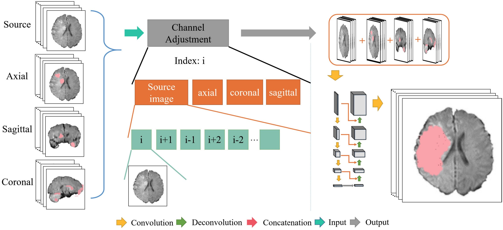

# MPFN
Description regarding our paper [Ischemic Stroke Lesion Segmentation Using
Multi-Plane Information Fusion](https://ieeexplore.ieee.org/stamp/stamp.jsp?arnumber=9019873)



# Abstract
Diffusion-weighted magnetic resonance imaging (DWI) is sensitive to acute ischemic stroke and is a common diagnostic method for the stroke. However, the diagnostic result relies on the visual observation of neurologists which may vary from doctor to doctor under different circumstance. And manual segmentation is often a time-consuming and subjective process. The time from onset to thrombus removal has a significant impact on the prognosis of patients with acute ischemic stroke. The shorter the time, the better the prognosis. For this purpose we present a novel framework to quickly and automatically segment the ischemic stroke lesions on DWI. We mainly have three contributions: firstly, we design a detection and segmentation network (DSN) to solve the two kinds of data imbalance; secondly, we propose a triple-branch DSN architecture, used for extracting different plane feature respectively; thirdly, we propose a multi-plane fusion network (MPFN), which aims to make final prediction more accurate. Extensive experiments on ISLES2015 SSIS DWI sequence dataset demonstrate the superiority of our proposed segmentation method. The dice reached 62.2% and the sensitivity reached 71.7%.

# Data
You can download the dataset from [HERE](https://drive.google.com/drive/folders/1Dtxl38k_31t_H0ybxN_a2kEL9-81TiVd?usp=sharing) (Google Drive)

[ISLES2015](https://www.smir.ch/ISLES/Start2015)

# Data usage and licensing

This ISLES2015 database is made available under Open Database License whose full text can be found at http://opendatacommons.org/licenses/dbcl/.

Any rights in individual contents of the database are licensed under the Database Contents License whose text can be found at http://opendatacommons.org/licenses/dbcl/. A more human-readable summary can be found under http://opendatacommons.org/licenses/odbl/summary/

# Citation
If our paper helps your research, please cite this paper:

```
@article{zhang2020ischemic,
  title={Ischemic Stroke Lesion Segmentation Using Multi-Plane Information Fusion},
  author={Zhang, Long and Song, Ruoning and Wang, Yuanyuan and Zhu, Chuang and Liu, Jun and Yang, Jie and Liu, Lian},
  journal={IEEE Access},
  volume={8},
  pages={45715--45725},
  year={2020},
  publisher={IEEE}
}
```

Please also cite the challenge article if you use the data:

Oskar Maier et al.
ISLES 2015 - A public evaluation benchmark for ischemic stroke lesion segmentation from multispectral MRI
Medical Image Analysis, Available online 21 July 2016, ISSN 1361-8415
http://dx.doi.org/10.1016/j.media.2016.07.009. 

### If you have questions, please contact us: czhu@bupt.edu.cn
